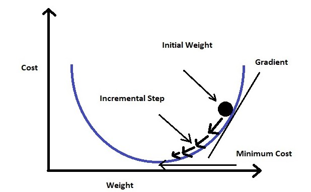

# This repository holds the basic fundamentals of logistic regression
### We know that logistic regression is treated as a single neuron and a nural network is a collection of neurons. Hence we can say that logistic regression is the fundamental building block of deep neural networks

## Problems related to Logistic Regression :
### Donut problem :

#### So Linear regression might not be good for this donut problem because there is no line that can separate the two dataset here in this case I's the Yellow and the Purple data point sets
```
TRICK OF THE DONUT PROBLEM:
       The trick with the donut problem is -> We are going to create yet another column which represents the radius of a point
       this will make your data points linearly separable

Code->
       r = np.zeros((N,1)) # creating a N size and 1 dimension of numpy array
       #manually calculate the radiuses
       for i in range(N):
           r[i] = np.sqrt(X[i,:].dot(X[i,:]))
       #Now then I do my concatenation the ones and the radiuses and It's all togeather
       #axis=1 -> adding ones npArray, r npArray and X npArray by column
       Xb = np.concatenate((ones,r,X), axis = 1)
```
#### In general you will have to experiment a little bit to find the right number for these values or you could use something like cross-validation
```
#set the learning rate to 0.0001
learning_rate = 0.0001
```

#### Calculating weights
```
for i in range(5000):
    #keep track of cross entropy so we can see how it evolves over time
    e = cross_entropy(T,Y)
    error.append(e)
    #print the cross_entropy every 100 times
    if i % 100 == 0:
        print(f"Cross_entropy error function : {e}")

    # using gradient with L2 regularization to find the optimal weights for the entropy function
    # L2 penalty here is 0.01 and L2 regularization is 0.01*w
    w+=learning_rate * (np.dot((T-Y).T, Xb) - 0.01*w)
    #re-calculating the output
    Y = sigmoid(Xb.dot(w))
```

#### Print the final weights and Final classification of the model
```
print(f"Final weights : {w}")
#when we are classifying we are actually rounding the output from the sigmoid function here in this case it's Y
print(f"Final classification rate : {1-np.abs(T-np.round(Y)).sum() / N}")
```

#### Explaining the output of the model
```
'''
    bias             radius        x coordinate    y coordinate
[-1.19218610e+01  1.60701810e+00  1.07760033e-03  9.60229312e-03]
The output of this is that our x and y are pretty close to zero
Classification doesn't really depend on the x and y coordinate at all is what this model has found
This model has found that the classification depends on the bias
here the radius that we'v put in the small radius and we have automatically have this bias to be -ve and that pushes the classification
towards zero
If the radius is bigger then it pushes the classification towards one
So that's how you can solve the donut problem
'''
```

### XOR problem :

#### Here you can see that there are 4 data points 2 are from class yellow and 2 are from class purple. So the trouble using logistic regression here is that you can't really find the line that will give you a perfect classification
#### REASON WHY LOGISTIC REGRESSION ISN'T APPLICABLE IN THIS XOR CASE ->
Here you can see that there are 4 data points 2 are from class yellow and 2 are from class purple.
So the trouble using logistic regression here is that you can't really find the line that will give you a perfect classification
#### TRICK TO SOLVE XOR PROBLEM VIA LOGISTIC REGRESSION ->
So the Trick is with the XOr problem is we're again going to add another dimension to our input
So We are going to turn it into a 3D peoblem instead of a 2D problem and then we can draw a plane between the two datasets
--> If we multiply the x and y to a new variable we can make the data linearly separable
```
xy = np.matrix(X[:,0]*X[:,1]).T
#Now then I do my concatenation the ones and the xy npArray and It's all togeather
#axis=1 -> adding ones npArray, xy npArray and X npArray by column
Xb = np.array(np.concatenate((ones,xy,X), axis=1))

'''
The rest of the code will be the same
'''
```
### These past two example bring out a really interesting point ->
#### You saw that we could apply the logistic regression to some compex problems by manual feature engineering. So we looked at the data and we determine some features that we could calculate the inputs that would help us improve our classification. Now in machine learning ideally the machine would be able to learn these things and so that is precisely what neural networks do. So in the future we will apply these problems and implement a neural networks that will automatically learn the features like this

## Gradient Descent :
#### Final output after applying gradient descent to find weights for the logistic regression function instead of randomly selecting weights

#### This is the graph that helps you visualize how a gradient descent is done

### Note->
Logistic function = Sigmoid funtion
#### The Sigmoid funtion graph is shown as below ->


# Sentiment Analysis with Logistic Regression
## Case 1 : Without L1 Regularization
#### Findings during my testing ->
1. SciKitLearn Logistic regression class performance was around 0.72
   ```
   Using Logisitc Regression from scikitLearn
   Classification rate : 0.72
   ```
2. Logistic regression when applied from scratch with gradient descent and not using LogisticRegression Class from ScikitLearn I got performance of
   0.76
   ```
   Final train classification rate : 0.8694736842105263
   Final test classification rate : 0.76
   ```
3. This is the train vs test cost graph for 20,000 epox

4. This is the weight graph for 20,000 epox

6. Learning rate is set to 0.001
## Case 2 : With L1 Regularization
#### Findings during my testing ->
1. SciKitLearn Logistic regression class performance was around 0.61
   ```
   Using Logisitc Regression from scikitLearn
   Classification rate : 0.61
   ```
2. Logistic regression when applied from scratch with gradient descent with L1 Regularization and not using LogisticRegression Class from ScikitLearn I got performance of
   0.56
   ```
   Final train classification rate : 0.6652631578947369
   Final test classification rate : 0.56
   ```
3. This is the train vs test cost graph for 20,000 epox

4. This is the weight graph for 20,000 epox

6. Learning rate is set to 0.001 and L1 penalty was set to 1.0

## NOTE :
### Here in L1 regularization we expect sparse solutions, i.e. some weights will be pushed to exactly zero
## Case 3 : Logistic regression with hyperparameter tuning
1. SciKitLearn Logistic regression class with hyper parameter tuning performance was around 0.840
The best hyper parameters found by GridSearchCV (C=4.281332398719396, penalty='none', solver='sag')
   ```
   Findings when looking through the console
   best model hyperparameters for logisticRegressionModel :
   LogisticRegression(C=4.281332398719396, penalty='none', solver='sag') Accuracy : 0.840
   ```
   ```
   best hyperparameters for logistic regression model : LogisticRegression(C=4.281332398719396, penalty='none', solver='sag')
   Model Predictions : [0. 1. 1. 1. 1. 1. 1. 0. 0. 1. 1. 1. 1. 0. 0. 1. 0. 0. 0. 0. 1. 1. 1. 0.
   0. 0. 1. 1. 0. 1. 0. 1. 0. 0. 1. 0. 1. 1. 0. 1. 1. 1. 1. 0. 0. 0. 1. 0.
   1. 1. 0. 0. 1. 1. 1. 1. 0. 1. 0. 1. 0. 1. 0. 0. 0. 1. 1. 1. 0. 1. 0. 0.
   0. 1. 1. 0. 0. 1. 1. 0. 0. 0. 1. 1. 0. 1. 1. 0. 0. 1. 0. 1. 1. 1. 0. 1.
   0. 1. 0. 1.]
   Targets or Ytest : [0. 0. 1. 1. 1. 1. 1. 0. 0. 1. 1. 1. 1. 0. 0. 1. 0. 0. 1. 1. 1. 1. 1. 1.
   0. 0. 0. 0. 0. 1. 0. 1. 1. 0. 1. 0. 1. 1. 0. 1. 1. 1. 1. 0. 0. 0. 0. 0.
   1. 1. 0. 1. 1. 1. 1. 1. 0. 1. 0. 1. 0. 1. 1. 0. 0. 1. 0. 0. 0. 0. 0. 0.
   0. 1. 1. 0. 0. 1. 1. 1. 1. 0. 1. 1. 0. 1. 1. 0. 0. 1. 0. 1. 1. 1. 1. 1.
   1. 1. 0. 1.]
   Accuracy : 0.840
   ```
## Note :
### The code related to case 3 is incorporated in sentiment_analysis_without_L1_regularization.py file. I did not make a separate file case 3 demonstration SORRY.
## Conclusion :
#### As you can see the improvements are quite clear performance of case 1 < case 2 < case 3. I am sure there is still some room for improvements. My research is under progress. I will update this once I find anything on this topic. For now I will stop it here.
# Facial expression recognition
## Class imbalance :
#### Here in facial expression recognition problem we have 547 samples from class 1 and 4953 samples from class 0. This is a severe problem because this means that your model will suffer severe hits during its learning process and it will try to classify the unseen data as class 0 most of the time.
## Solution to class imbalance :
####  Suppose we have 1000 samples from class 1 and 100 samples from class 2
1. Pickup 100 samples from class 1,now we have 100 from class 1 vs 100 from class 2.
2. Repeat class 2 10 times , now we have 1000 from class 1 vs 1000 from class 2.
#### NOTE that these 2 strategies both have the same expected error rate. Method 2 is much better because we know variance also play an important role when training a model on a dataset. Hence promoting us to feed more data to the model for better output results during training.
## Other accuracy measures :
#### Note that there are other ways to measure the acurracy as well that allow for class imbalances. These are used in the medical field and in information retrieval and try to take into account both classes. This assumes we are doing binary classification.
#### The basic idea behind this is :->
1. Maximize both true positives and true negatives
2. Minimize both false positives and false negatives

#### What is false positive and false negative ?
1. False positive : A false positive is when you predict the positive class but the actual label is the negative class.
2. False negative : A false negative is when you predict the negative class but the actual label is the positive class.
#### Note : The accuracy is (TP + TN)/(TP+TN+FP+FN) where TP is true positive , TN is true negative , FP is false positive and FN is false negative.
#### In the medical field we use sensitivity and specificity
1. Sensitivity or True positive rate : TP/(TP+FN)
2. specificity or True negative rate : TN/(TN+FP)
#### In information retireval we use precision and recall
1. Precision : TP/(TP+FP)
2. Recall or sensitivity : TP/(TP+FN)
#### Total score is F1-Score Combines precision and recall into a balanced measure F1 = 2*(precision*recall)/(precision+recall). This is the harmonic mean of precision and recall
## Final score :
#### The validation Score after training of logistic regression model is complete is -> ```best validation error : 0.14```
#### The graph after the training of logistic regression model is complete ->

