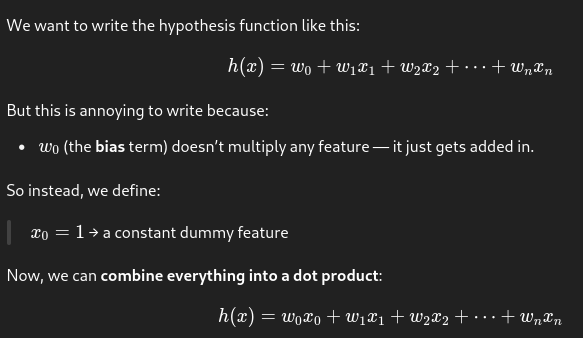
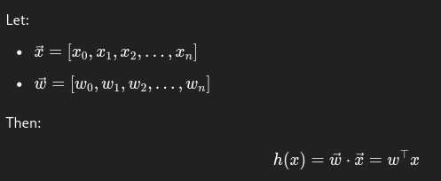
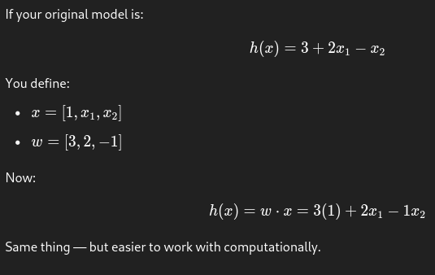

---

## 📌 Why introduce a dummy variable \( x_0 = 1 \)?

---

### ✅ Vector form:

This makes the math:
- Shorter
- Cleaner for gradients and matrix operations
- Easier for generalization (works in any dimension)

---

### 🧠 Example:

If your original model is:

---

### 📈 Bonus:

- This trick is heavily used in **linear regression**, **logistic regression**, and **neural networks**.
- Frameworks like TensorFlow and PyTorch usually **include the bias as a separate parameter**, but mathematically it's equivalent to this dummy-feature trick.

---

