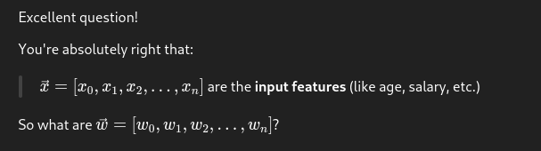
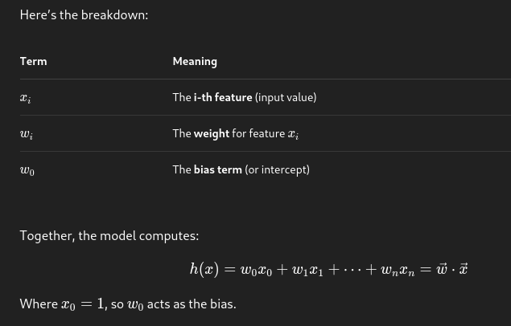
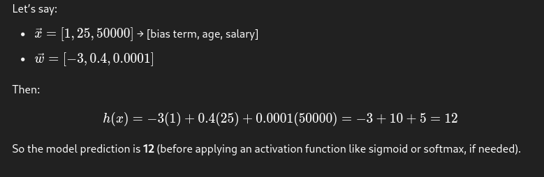

---

### ✅ **\( \vec{w} \) are the model's learned parameters — the weights**

---

### 🧠 Intuition:

- Each **feature** \( xi \) represents some measurable input (like age, education, etc.)
- Each **weight** \( wi \) tells the model **how important** that feature is.
- **Positive \( wi \)**: increases the prediction
- **Negative \( wi \)**: decreases the prediction
- The model **learns** these \( wi \)'s during training by minimizing some loss function

---

### 🧮 Example:

---

